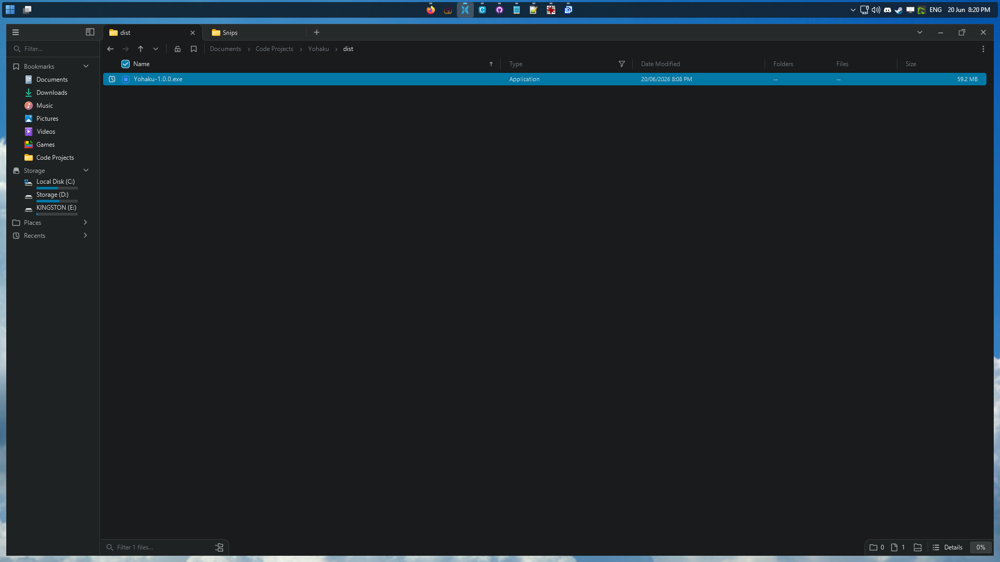

# Yohaku 余白

A lightweight Windows 11 background (tray) app that adds a configurable **margin
around every monitor**, so maximised (and snapped) windows get a gap from the
screen edges, while staying **genuinely maximised**.

> *Yohaku* (余白) is the Japanese term for intentional blank space: the margin
> left around the content. That's exactly what this app reserves.



## How it works

In Windows 11 a maximised window fills the monitor **work area** (`rcWork`, the
screen minus the taskbar). The taskbar reserves its space by registering as an
**application desktop toolbar (appbar)**.

Yohaku does the same thing: on each monitor it registers four thin appbars
(top/bottom/left/right) that reserve your configured margin. That shrinks the
work area, so when *any* window maximises, Windows sizes it to the smaller area
automatically.

Crucially, the window is **truly maximised**: real `WS_MAXIMIZE` state, the
correct "restore down" caption-button glyph, and apps receive `SIZE_MAXIMIZED`.
There's no window-hijacking, no flash, no DLL injection, and it works on every
app including elevated/protected ones.

### Features

- ✅ Truly maximised windows, inset by a per-edge margin, on every monitor.
- ✅ A separate inset for the taskbar's edge (`TaskbarInset`), with auto-hide handled.
- ✅ Per-monitor DPI scaling so the gap looks consistent across mixed-DPI setups.
- ✅ Rebuilds automatically when monitors are added/removed or resolution/DPI
  changes; releases all reservations on exit.

Fullscreen games are unaffected: exclusive fullscreen isn't a window state, and
borderless-fullscreen windows aren't maximised, so neither is constrained by the
work area.

## Download & run

Grab the latest **`Yohaku-<version>.exe`** from the
[Releases](https://github.com/DavidF-Dev/Yohaku/releases) page and run it. It's one
self-contained executable: no installer, and no .NET runtime to install.

- **Requires** Windows 11 (64-bit).
- **Unsigned:** Windows SmartScreen will warn with "Windows protected your PC". Click
  **More info → Run anyway**. Each release publishes the exe's **SHA-256** so you can
  verify the download (`Get-FileHash Yohaku-<version>.exe`).

Yohaku runs in the system tray; right-click the icon for options. See
[CHANGELOG.md](CHANGELOG.md) for what's in each release.

> Always quit via the tray **Exit** (or let Windows shut it down) so the appbar
> reservations are released cleanly. If the process is force-killed, Windows
> reclaims the reserved space on the next work-area recalculation anyway.

### Run at login (optional)

Toggle **Start with Windows** in the tray menu. It adds (or removes) a per-user
entry under `HKCU\…\CurrentVersion\Run` that launches Yohaku at sign-in, with no
admin rights required.

## Build from source

```powershell
dotnet build Yohaku.slnx -c Release
.\src\Yohaku\bin\Release\net8.0-windows\Yohaku.exe
```

## Tests

```powershell
dotnet test Yohaku.slnx          # unit tests (xUnit)
```

The unit tests cover the pure logic (per-monitor DPI scaling, per-edge strip
geometry, config round-trip). The appbar reservation itself needs a live desktop
session, so it's verified by the PowerShell scripts in `tests/integration/`
(not headless-CI-runnable):

```powershell
.\tests\integration\measure_workarea.ps1            # print each monitor's work area
.\tests\integration\verify_maximize.ps1 -Inset 12   # confirm a maximised window is inset
```

## Configuration

`%APPDATA%\Yohaku\config.json`, hot-reloaded on save:

```json
{
  "InsetTop": 12,
  "InsetRight": 12,
  "InsetBottom": 12,
  "InsetLeft": 12,
  "TaskbarInset": 8
}
```

Each `Inset*` value is the margin for that edge in logical (96-DPI) pixels, scaled
per monitor by its DPI.

`TaskbarInset` is **optional**. When set, it overrides the inset on whichever edge
holds the taskbar, but only on monitors where the taskbar actually reserves space,
so an auto-hidden taskbar (or a monitor that doesn't show the taskbar) falls back to
the normal per-edge inset. Omit it to use the per-edge values everywhere.

## Logs

`%APPDATA%\Yohaku\yohaku.log` (self-truncating at ~1 MB).

## License

[MIT](LICENSE) © 2026 David F Dev.
